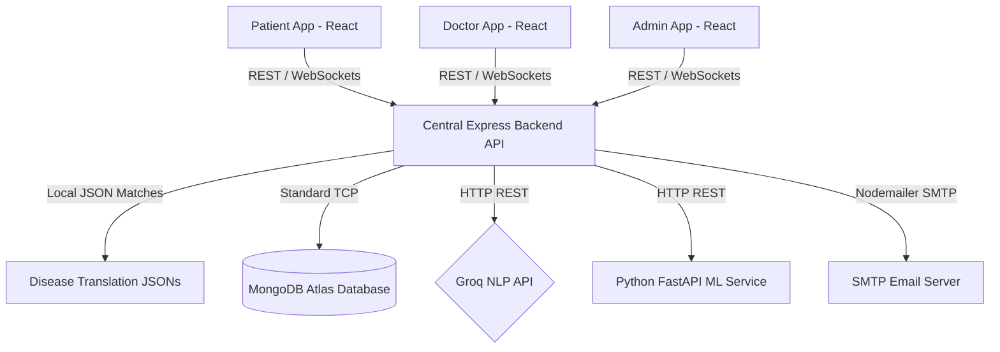
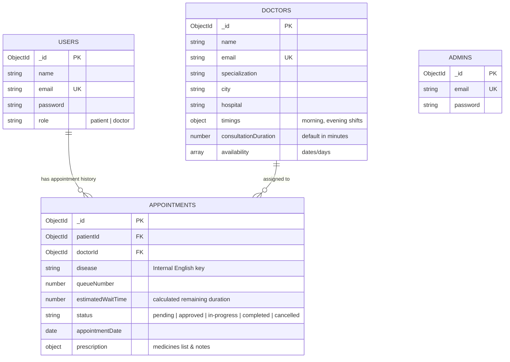

# AI-Powered Multilingual Disease Detection & Smart Hospital Queue Management System
## System Architecture & Technical Specifications

This document defines the production system architecture, user roles, database schema designs, core workflows (AI/NLP, Queue Management, Multilingual), security rules, and deployment models based on the final project requirements.

---

## 1. System Topology & Services Directory

The system is built as a highly responsive multi-application service model connected through a centralized backend gateway.



### Folder Structure
```text
health-ai-queue-system/
├── backend/                       # Node.js + Express Central API
│   ├── src/
│   │   ├── config/                # Database connection & socket configurations
│   │   │   ├── db.js
│   │   │   └── socket.js          # Socket.io connection pool
│   │   ├── controllers/           # Application logic layer
│   │   │   ├── authController.js
│   │   │   ├── doctorController.js
│   │   │   ├── appointmentController.js
│   │   │   ├── aiController.js
│   │   │   └── adminController.js
│   │   ├── data/                  # Multilingual Disease assets
│   │   │   ├── disease_en.json
│   │   │   ├── disease_gu.json
│   │   │   └── disease_hi.json
│   │   ├── middlewares/           # Custom Express middlewares
│   │   │   ├── authMiddleware.js  # Role authentication (RBAC) & JWT
│   │   │   ├── errorMiddleware.js
│   │   │   └── validate.js        # express-validator rules
│   │   ├── models/                # Mongoose Database schemas
│   │   │   ├── User.js            # Unified collection for Patients & Doctors
│   │   │   ├── Doctor.js          # Professional profiles, shifts, queues
│   │   │   ├── Appointment.js     # Queue tracking, diagnosis, prescription details
│   │   │   └── Admin.js           # Credentials for system administration
│   │   ├── routes/                # Route definitions
│   │   ├── services/              # External service abstractions (Groq, ML Service, Mailer)
│   │   └── app.js                 # Initialization with Helmet, rate limiters, middleware
│   ├── .env.example
│   └── package.json
│
├── frontend-patient/              # Patient Portal (React + Tailwind + i18n)
│   ├── src/
│   │   ├── components/            # UI components, dashboard widgets
│   │   ├── locales/               # Frontend translation bundles (en, gu, hi)
│   │   ├── pages/                 # Diagnosis, history, live queue tracking
│   │   └── App.jsx
│   └── package.json
│
├── frontend-doctor/               # Doctor Dashboard Portal (React + Tailwind + Socket.io-client)
│   ├── src/
│   │   ├── pages/                 # Schedule management, consultations, queue modifier
│   │   └── App.jsx
│   └── package.json
│
├── frontend-admin/                # Admin Panel (React + Dashboard analytics)
│   ├── src/
│   │   ├── pages/                 # Doctor management (CRUD), queue observers, stats
│   │   └── App.jsx
│   └── package.json
│
├── ai-model/                      # Python ML Service (FastAPI)
│   ├── app/
│   │   ├── main.py                # FastAPI app
│   │   ├── models/                # Pre-trained Random Forest Classifier
│   │   └── services/              # Inference & vectorized inputs preprocess
│   └── requirements.txt
```

---

## 2. Complete Technology Stack

* **Frontends**: React.js, Tailwind CSS, React Router, Axios (with authorization interceptors), React Hook Form, i18next & react-i18next (translation wrappers), Browser Speech Recognition API.
* **Backend API Gateway**: Node.js, Express.js, JWT (Access & Refresh tokens), bcrypt (password hashing), Socket.IO (bi-directional realtime streams), `express-validator` (strict sanitization), `helmet` (security headers), `express-rate-limit` (DDoS mitigation), Nodemailer (email notifications).
* **Database**: MongoDB Atlas (Cloud Database), Mongoose ODM.
* **AI/ML Service**: Python, FastAPI, Scikit-learn (Random Forest Classifier), Pandas, NumPy.
* **NLP Processing**: Groq Cloud API (Llama models optimized for entity extraction).

---

## 3. Database Schema Planning (MongoDB Atlas)



### 3.1 Users Collection (`User.js`)
Stores base credential data for Patients and Doctors.
```javascript
const UserSchema = new mongoose.Schema({
  name: { type: String, required: true },
  email: { type: String, required: true, unique: true, index: true },
  password: { type: String, required: true },
  role: { type: String, enum: ['patient', 'doctor'], default: 'patient' },
  appointmentHistory: [{ type: mongoose.Schema.Types.ObjectId, ref: 'Appointment' }]
}, { timestamps: true });
```

### 3.2 Doctors Collection (`Doctor.js`)
Maintains operational clinical profiles, locations, and shifts.
```javascript
const DoctorSchema = new mongoose.Schema({
  name: { type: String, required: true },
  email: { type: String, required: true, unique: true, index: true },
  specialization: { type: String, required: true, index: true },
  city: { type: String, required: true, index: true },
  hospital: { type: String, required: true },
  timings: {
    morningShift: {
      startTime: { type: String, default: "09:00" }, // 24h format "HH:MM"
      endTime: { type: String, default: "13:00" }
    },
    lunchBreak: {
      startTime: { type: String, default: "13:00" },
      endTime: { type: String, default: "15:00" }
    },
    eveningShift: {
      startTime: { type: String, default: "15:00" },
      endTime: { type: String, default: "18:00" }
    }
  },
  consultationDuration: { type: Number, default: 15 }, // standard mins per patient
  availability: [{ type: String }] // Array of available days/dates, e.g., ["Monday", "Tuesday"]
}, { timestamps: true });
```

### 3.3 Appointments Collection (`Appointment.js`)
Tracks the current state in the hospital queue.
```javascript
const AppointmentSchema = new mongoose.Schema({
  patientId: { type: mongoose.Schema.Types.ObjectId, ref: 'User', required: true, index: true },
  doctorId: { type: mongoose.Schema.Types.ObjectId, ref: 'Doctor', required: true, index: true },
  disease: { type: String, required: true }, // The canonical English key (e.g. "Typhoid")
  queueNumber: { type: Number, required: true },
  estimatedWaitTime: { type: Number, required: true }, // in minutes
  status: {
    type: String,
    enum: ['pending', 'approved', 'in-progress', 'completed', 'cancelled'],
    default: 'pending',
    index: true
  },
  appointmentDate: { type: Date, required: true, index: true },
  prescription: {
    medicines: [{
      name: String,
      dosage: String,
      duration: String
    }],
    notes: String,
    issuedAt: Date
  }
}, { timestamps: true });
```

### 3.4 Admins Collection (`Admin.js`)
Internal configuration schema for administrative users.
```javascript
const AdminSchema = new mongoose.Schema({
  email: { type: String, required: true, unique: true },
  password: { type: String, required: true }
});
```

---

## 4. Key Workflows & Engine Logics

### 4.1 End-to-End AI + NLP Diagnostic Pipeline
This pipeline maps speech/text in any supported language to predictions and recommended local doctors.

```mermaid
sequenceDiagram
    autonumber
    actor Patient as Patient Client
    participant Express as Central Express API
    participant Groq as Groq NLP API
    participant PyML as Python ML Service
    participant LangJSONs as Language JSON files
    database DB as MongoDB Atlas

    Patient->>Express: POST /api/v1/ai/detect { speechText: "મને તાવ લાગે છે", lang: "gu" }
    Express->>Groq: Query Llama: Extract symptoms in English from input
    Note over Groq: Process input sentence<br/>Translate/Map to clinical terms
    Groq-->>Express: Return English symptoms ["fever"]
    
    Express->>PyML: POST /predict { symptoms: ["fever"] }
    Note over PyML: Run Random Forest Classifier<br/>Vectorize inputs & infer disease
    PyML-->>Express: Return internal English disease key "Typhoid"
    
    Express->>LangJSONs: Load selected translation file (e.g., disease_gu.json)
    Note over Express: Fetch localized description & precautions<br/>Map internal key "Typhoid" -> specialization "General Physician"
    
    Express->>DB: Fetch doctors matching: specialization, patient's city, availability
    DB-->>Express: Return lists of Doctors
    Express-->>Patient: Return localized prediction details + doctor recommendations
```

### 4.2 Dynamic Queue Calculation & Scheduler
Rather than scheduling hard slots, patients book a date. The system dynamically arranges their position in the queue.

* **Wait Time Formula**:
  $$\text{Estimated Wait Time} = \text{Remaining Patients in Queue} \times \text{Consultation Duration}$$
  * *Remaining Patients*: Total appointments scheduled for that day prior to the current index with statuses of `pending`, `approved`, or `in-progress`.

* **Shift Boundary & Overflow Auto-Rejection**:
  When a patient requests a booking for a specific date:
  1. The backend counts the total current bookings for the doctor on that date.
  2. Sums total expected duration: $(N + 1) \times \text{consultationDuration}$ plus the duration of the lunch break shift gap.
  3. Checks if the total computed queue duration pushes the appointment completion time beyond the doctor's `eveningShift.endTime`.
  4. **Over Shift Limits**: Reject the booking, prompt the frontend, and suggest scheduling for the next calendar day.

### 4.3 Consultation Duration Realtime Update Flow
Doctors can alter active consultation durations. Socket.IO routes the recalculation downward immediately to active patient UI components.

```mermaid
sequenceDiagram
    autonumber
    actor Doctor as Doctor Client
    participant Express as Central Express API
    database DB as MongoDB
    participant Socket as Socket.IO Hub
    actor Patients as Active Patients

    Doctor->>Express: PATCH /appointments/:id/duration { newDuration: 30 }
    Note over Express: Recalculate estimated wait times<br/>for all subsequent pending patients in the doctor's queue
    Express->>DB: Batch update waiting times for queue
    Express->>Socket: Broadcast: emit("queue_updated", { doctorId })
    Socket->>Patients: Live update Estimated Waiting times on screens
```

---

## 5. Security & Verification Controls

* **Helmet.js Integration**: Headers set up to secure against clickjacking, CSS sniffing, and cross-site scripting vulnerabilities.
* **IP Rate Limiting**: Limit authentication routes to `10 requests per 15 minutes` and ML analysis routes to `5 requests per minute`.
* **Data Sanitization**: Strict schema sanitization utilizing `express-validator` to guarantee inputs match required types (validation schemas for emails, passwords, dates, and names).
* **Environment Configuration**: Secrets isolated completely outside of the repository boundary via standard env definitions.

---

## 6. Ports, Environments, and Security Configs

### Service Host Port Configurations
* **Patient Client App**: Port `3000` (Local) -> Deployed globally on Vercel (HTTPS on 443).
* **Doctor Client App**: Port `3001` (Local) -> Deployed globally on Vercel (HTTPS on 443).
* **Admin Client App**: Port `3002` (Local) -> Deployed globally on Vercel (HTTPS on 443).
* **Central API Gateway**: Port `5000` (Local) -> Deployed inside Docker on AWS ECS (Fargate).
* **Python FastAPI Microservice**: Port `8000` (Local/Internal Network) -> Only accessible internally inside the AWS VPC.

### Target Environment Definitions (`backend/.env`)
```bash
PORT=5000
NODE_ENV=production
MONGO_URI=mongodb+srv://<admin>:<secret>@cluster.mongodb.net/smarthealth?retryWrites=true&w=majority
JWT_SECRET=production_jwt_signature_secret_value
JWT_REFRESH_SECRET=production_jwt_refresh_signature_secret_value
GROQ_API_KEY=gsk_your_groq_production_cloud_key
AI_SERVICE_URL=http://fastapi-ml-service.internal:8000
EMAIL_HOST=smtp.sendgrid.net
EMAIL_PORT=587
EMAIL_USER=apikey
EMAIL_PASS=sg_production_smtp_mail_api_key
CLIENT_URL_PATIENT=https://patient.healthai.com
CLIENT_URL_DOCTOR=https://doctor.healthai.com
CLIENT_URL_ADMIN=https://admin.healthai.com
```
